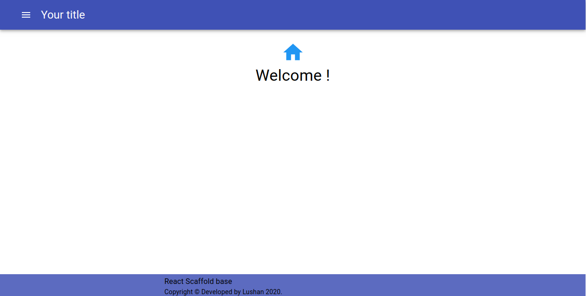
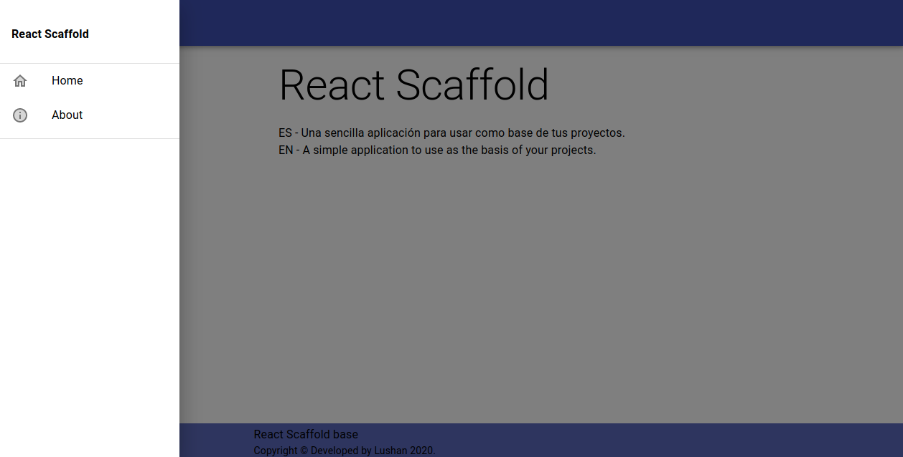

[![Contributors][contributors-shield]][contributors-url]
[![Stargazers][stars-shield]][stars-url]

# ReactJS Scaffold

Preview: [https://dracaster.github.io/react-scaffold/](https://dracaster.github.io/react-scaffold/)

* ESPAÑOL 

 _Olvidate de arrancar de cero! Con ReactJS Scaffold podes arrancar a desarrollar tu App Web con una plantilla básica._

 * INGLÉS

_Forget about starting from scratch! With this basic application you can start your projects in ReactJS faster._

## This application is developed with ReactJS and Material UI.

# As usual:

`npm install`

`npm start`

## Built With

* ReactJS
* Material UI
* React-Router-Dom

## Tags

* 0.1.0
    * First release

## Developer :computer:

Lujan Rojas – [@LushanKaramakov](https://twitter.com/LushanKaramakov) – lujanrojas.informatica@gmail.com

_Si te sirvió, hazmelo saber con una estrellita_ :star: :yellow_heart:

_If it served you, gift me a star_ :star: :yellow_heart:

[https://github.com/DraCaster/](https://github.com/DraCaster/)

***Hecho con amor - Alt + 3***

<!-- MARKDOWN LINKS & IMAGES -->
<!-- https://www.markdownguide.org/basic-syntax/#reference-style-links -->

[stars-shield]: https://img.shields.io/github/stars/dracaster/react-scaffold.svg?style=flat-square
[stars-url]: https://github.com/dracaster/react-scaffold/stargazers
[contributors-shield]: https://img.shields.io/github/contributors/dracaster/react-scaffold.svg?style=flat-square
[contributors-url]: https://github.com/dracaster/react-scaffold/graphs/contributors
